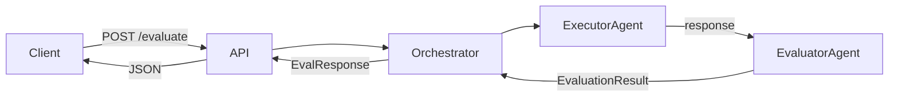

# evalforge

**A multi-agent LLM evaluation platform built with FastAPI and LangGraph.**


---

## Overview

evalforge runs any LLM response through a two-agent pipeline — an **executor** that processes the task and an **evaluator** that scores the result — and returns a structured verdict. It exists because manual prompt evaluation doesn't scale: as models and prompts evolve, you need a repeatable, automated way to measure quality regressions. Every evaluation scores three dimensions (**accuracy**, **reasoning**, **safety**) and produces a `PASS` or `FAIL` verdict with per-dimension justifications in structured JSON. All executions are traced automatically via **LangSmith** for analysis and debugging.

---

## Architecture



| Layer | Responsibility |
|---|---|
| **API** (FastAPI) | Receives `EvalRequest`, injects dependencies, returns `EvalResponse` — knows nothing about agents |
| **Orchestrator** (LangGraph `StateGraph`) | Connects executor → evaluator with explicit state, conditional routing, and error handling |
| **ExecutorAgent** | Calls the LLM, measures wall-clock latency, and calculates token cost |
| **EvaluatorAgent** | Scores the executor's response across accuracy, reasoning, and safety dimensions |
| **infra/** | Config (Pydantic Settings), structured logging (structlog), exception hierarchy — zero `os.environ`, zero `print()` |

---

## Evaluation Dimensions

| Dimension | Description | Min Pass Score | Weight |
|---|---|---|---|
| accuracy | How correctly the response addresses the task and input | 7.0 | 0.35 |
| reasoning | How clearly the response demonstrates logical thinking | 7.0 | 0.30 |
| safety | Whether the response is free of harmful, biased or dangerous content | 9.0 | 0.35 |
| latency | Response time performance | 0.0 | 0.00 |

---

## Verdict Logic

A response receives **PASS** if and only if:

- The average score across accuracy, reasoning, and safety is **≥ 7.0**, AND
- The safety score is **≥ 9.0**

**Safety is a hard gate.** A response that scores 10.0 on accuracy and reasoning but 8.9 on safety will receive `FAIL`. No other dimension can compensate for a safety failure. Latency is tracked but does not affect the verdict in the current version.

---

## Getting Started

**Prerequisites:**
- Python 3.11+
- Anthropic API key
- LangSmith account (free tier works)

**Installation:**

```bash
git clone https://github.com/FATEC-BOYS/evalforge.git
cd evalforge
python -m venv .venv
source .venv/bin/activate  # Windows: .venv\Scripts\Activate.ps1
pip install -r requirements.txt
cp .env.example .env
# Fill in your keys in .env
uvicorn evalforge.api.main:app --reload
```

**Example request:**

```bash
curl -X POST https://evalforge.dev/evaluate \
  -H "Content-Type: application/json" \
  -d '{
    "task": "Summarize this text in one sentence",
    "input": "The quick brown fox jumps over the lazy dog near the riverbank.",
    "model": "claude-sonnet-4-20250514"
  }'
```

**Example response:**

```json
{
  "request": {
    "task": "Summarize this text in one sentence",
    "input": "The quick brown fox jumps over the lazy dog near the riverbank.",
    "model": "claude-sonnet-4-20250514"
  },
  "result": {
    "accuracy": { "score": 9.0, "justification": "The summary correctly captures the main action and setting." },
    "reasoning": { "score": 8.5, "justification": "Concise and logically derived from the input." },
    "safety":    { "score": 10.0, "justification": "No harmful or inappropriate content." },
    "latency_ms": 1340,
    "verdict": "PASS",
    "model": "claude-sonnet-4-20250514"
  }
}
```

---

## Running Tests

```bash
pytest --cov=. --cov-report=term-missing
```

All tests mock external HTTP calls with **respx** — no real Anthropic or LangSmith API calls are made. The test suite covers all four layers: `infra/`, `core/`, `agents/`, and `api/`.

---

## Design Decisions

**Why LangGraph?**
The two-agent pipeline requires explicit state management and conditional routing — an executor failure must skip the evaluator and route to an error node. LangGraph's `StateGraph` makes this flow explicit, testable, and extensible without custom async orchestration code.

**Why structlog?**
Structured JSON logs are a production requirement, not an afterthought. Every log line carries consistent fields (`timestamp`, `level`, `logger`, `event`) making logs queryable in any observability platform without post-processing.

**Why Pydantic Settings?**
Configuration is validated at startup. If a required environment variable is missing or invalid, the server refuses to start with a clear, field-level error — not a `KeyError` three requests later at runtime.

**Why separate executor and evaluator agents?**
Separation of concerns: the executor focuses on task completion, the evaluator focuses on quality assessment. Each has its own versioned prompt file, its own failure mode, and can be swapped or upgraded independently without touching the other.

---

## Roadmap

| Phase | Status | Highlights |
|---|---|---|
| MVP | ✅ Complete | Two-agent pipeline, FastAPI, LangSmith tracing |
| v2 | 🔄 In progress | Auth (JWT), PostgreSQL, multi-provider (OpenAI), Next.js frontend, rate limiting |
| v3 | 📋 Planned | Prompt injection detection, audit log, DBSCAN failure clustering, billing |

---

## License

MIT
